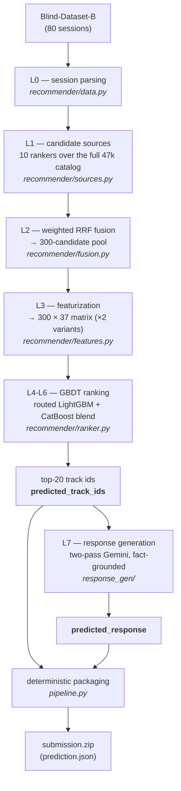
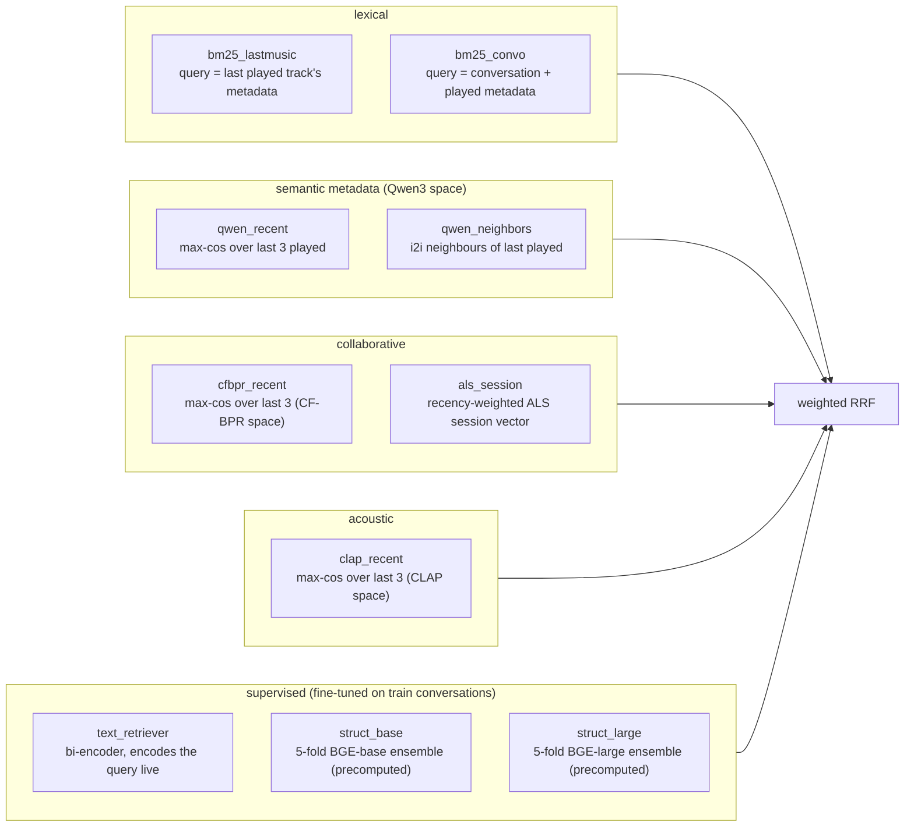
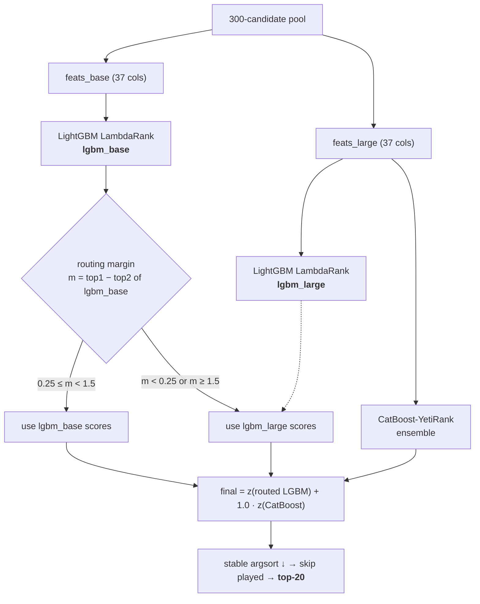
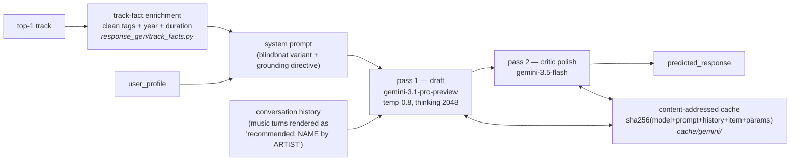
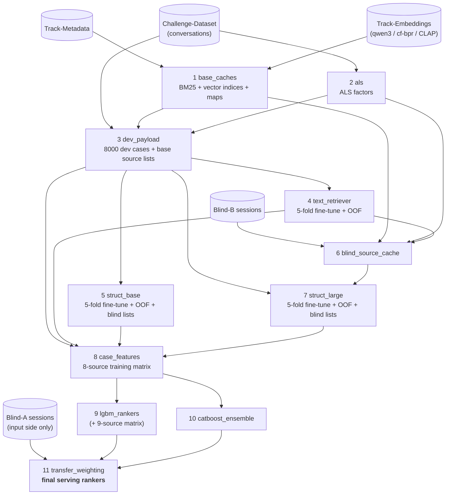
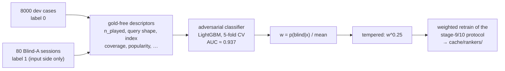

# Pipeline documentation

How the system works, level by level. For reproduction steps see
[INFERENCE.md](INFERENCE.md) and [TRAINING.md](TRAINING.md).

## Overview

Each session is processed by two independent halves. Their outputs go side by side into
one `prediction.json` record: `predicted_track_ids` (scored by nDCG@20) and
`predicted_response` (scored by an LLM judge, plus diversity terms). The recommendation
half is deterministic. The response half is an LLM call; the submitted outputs replay
from a shipped response cache.

## L0 — session parsing

A raw session is a `conversations` list with three roles: `user`, `assistant`, and
`music` (the content of a `music` turn is the track_id played at that point).
`recommender/data.py::parse_last_turn` extracts, per session:

- `user_query`: the last user turn, i.e. the request the pipeline answers;
- `history`: every prior turn, in order;
- `music_turns`: the ordered already-played track ids. Used both as recency anchors for
  the sources and as the set of tracks that must not be recommended again;
- `user_profile`: up to three demographic fields, read only by the response half.

## L1 — candidate sources

Ten rankers, each producing an ordered candidate list over the entire `all_tracks`
catalog (47,071 tracks). They are intentionally of different kinds — rank fusion helps
when the sources fail in different ways.

| source | family | index / model | query construction | depth | RRF weight |
|---|---|---|---|---|---|
| `bm25_lastmusic` | lexical | BM25 over name+artist+album+tags | titled metadata of the last played track | 100 | 1.0 |
| `bm25_convo` | lexical | same index | all user turns (recency-boosted) + untitled metadata of all played | 100 | 1.0 |
| `qwen_recent` | semantic | Qwen3 metadata embeddings (official) | max cosine over the last 3 played | 100 | 0.0* |
| `qwen_neighbors` | semantic | same | item-to-item neighbours of the last played | 100 | 0.0* |
| `cfbpr_recent` | collaborative | CF-BPR item embeddings (official) | max cosine over the last 3 played | 100 | 1.0 |
| `als_session` | collaborative | ALS factors (trained, stage 2) | dot with a recency-weighted session vector | 200 | 1.0 |
| `clap_recent` | acoustic | CLAP audio embeddings (official) | max cosine over the last 3 played | 100 | 0.5 |
| `text_retriever` | supervised | fine-tuned BGE-base bi-encoder | last 3 user turns + current query, encoded live | 300 | 1.0 |
| `struct_base` | supervised | 5-fold BGE-base, structured queries | `[QUERY] … [HISTORY] … [CONTEXT] …` (precomputed per session) | 300 | 1.0 |
| `struct_large` | supervised | 5-fold BGE-large | same construction (precomputed per session) | 300 | 2.0 |

\* the two qwen sources have zero fusion weight but stay in the source set: their
per-candidate rank/membership are used as L3 features. `struct_large` is the strongest
single source and gets double weight. `als_session` also returns the session vector it
built, reused at L3 as the `als_dot` feature.

`struct_base` and `struct_large` run no model at inference. Their 5-fold blind outputs
are precomputed offline (`blind_lists_blind_b.json`): each session is encoded by each
fold model and the scores are ensembled. One behavioral difference is kept as-is from
the validated pipeline: `struct_base` masks played tracks inside its lists,
`struct_large` does not (the played mask is applied once, at L6).

## L2 — weighted Reciprocal Rank Fusion

Every candidate accumulates `score = Σ_sources weight / (RRF_K + rank)` with
`RRF_K = 20` and 1-based ranks. The top `POOL_K = 300` by fused score form the recall
pool. RRF works on rank positions only, so scores on incompatible scales (BM25 sums,
cosines, ALS dot products) can be fused without calibration; the damping constant keeps
a single source from forcing an item to the top on its own.

## L3 — featurization (300 × 37, two variants)

Each pool candidate becomes a 37-value row (`recommender/features.py`):

| cols | block | content |
|---|---|---|
| 0-7 | context / content | fused-rank inverse; artist match and tag Jaccard vs the last played; query↔artist/title/metadata token overlaps; is-played; recency-weighted artist+tag affinity over the whole history |
| 8-19 | source membership | rank-inverse (8-13) and presence (14-19) in the 6 live sources (qwen×2, bm25×2, cfbpr, als) |
| 20, 26 | agreement | number of live sources containing the candidate (col 26 is a locked duplicate of 20, kept for artifact compatibility) |
| 21-25 | collaborative / global | `als_dot` (candidate ⋅ session vector); history length; normalised popularity; pool-artist fraction and count |
| 27-28 | text_retriever | rank-inverse + presence in the bi-encoder's list |
| 29-33 | album overlap | same-album-as-last1/last3/any; album history count; pool same-album fraction |
| 34-36 | retriever triple | rank-inverse / presence / raw cosine of `struct_base` (variant A) or `struct_large` (variant B) |

The two variants, `feats_base` (struct_base triple) and `feats_large` (struct_large
triple), are identical in the first 34 columns. Each GBDT model is trained on the
variant it is served.

## L4-L6 — ranking

The routing rule reads the base ranker's top1-top2 margin as a confidence signal: below
0.25 there is no clear winner, above 1.5 the score is usually over-confident; in both
cases the struct_large-variant booster is used instead. The routed LightGBM scores are
then blended, in z-score space and at equal weight, with the CatBoost-YetiRank ensemble
— a different listwise loss on a different GBDT implementation, so its errors are only
weakly correlated with LightGBM's. Ties are broken by a stable mergesort, which keeps
the ordering deterministic.

## L7 — response generation

The generator writes about the top-1 recommended track, with its catalog facts injected
into the prompt and an explicit anti-fabrication directive. Every LLM call is
content-addressed in `cache/gemini/`; the shipped cache holds the submitted run's 160
entries (80 drafts + 80 polishes), so the submission replays without any API call.

## Packaging

`pipeline.py::_deterministic_zip` writes `prediction.json` with stable key order and a
fixed 1980-01-01 zip timestamp. An unchanged prediction therefore produces an identical
file, which is what makes the submitted hashes (`payload 5cbb4216…`, `zip 5248ffb0…`)
usable as verification targets.

## Training pipeline

Eleven idempotent stages (`training/train_all.py`); arrows are data dependencies:

Two constraints hold across the graph. First, ranker training only ever consumes
out-of-fold retriever lists: a single grouped-session 5-fold split is shared by all
three supervised retrievers, and each dev case is scored by the fold model that held it
out. Second, stage 8 builds its matrices with the same `featurize` and `weighted_rrf`
code the live recommender runs, so training and serving compute features identically.

### Stage 11 — transfer weighting

Dev sessions and blind sessions differ systematically (session depth, query shape, how
well the embedding indices cover the played tracks, played-track popularity). The final
rankers correct for this with importance weighting:

The classifier separates dev cases from Blind-A sessions using input-side descriptors
only — no label or gold track of any evaluation set is involved. Dev cases that resemble
blind sessions get more weight in the training loss; the 0.25 exponent tempers the
reweighting.

## Compliance notes

- Every source retrieves from the full `all_tracks` catalog; there is no split filtering
  at any stage (training, inference, or post-processing).
- All inputs are the official challenge datasets plus two public BGE checkpoints; the
  complete list is in [TRAINING.md](TRAINING.md) §0.
